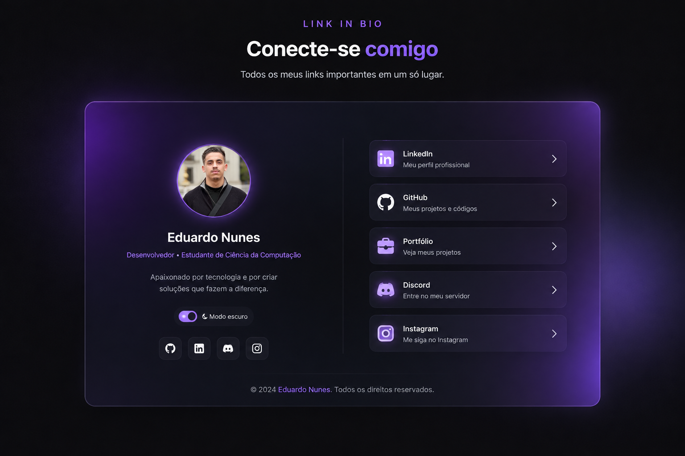

# 🔗 Link in Bio

<h1> Um site pessoal para centralizar meus principais links profissionais, projetos e redes sociais.</h1>

---

## 🚀 Tecnologias

Esse projeto foi desenvolvido utilizando as seguintes tecnologias:

- HTML5
- CSS3
- JavaScript
- Git e Github
- Figma

---

## 💻 Projeto

O **Link in Bio** é uma página pessoal desenvolvida para reunir, em um único lugar, meus principais canais e projetos.

A página conta com:

- 🔗 Acesso ao LinkedIn
- 💻 Acesso ao GitHub
- 📸 Acesso ao Instagram
- 🎮 Acesso ao Discord
- 🌓 Alternância entre tema claro e escuro
- 📱 Layout responsivo

  

  

---

## 🎨 Layout

O projeto possui uma interface moderna e minimalista, com foco em uma navegação simples e objetiva.

---

## 🌐 Acesse o projeto

Você pode acessar o projeto através do GitHub Pages:

**[Acessar Link in Bio](COLOQUE_AQUI_O_LINK_DO_SEU_SITE)**

---

## 👨‍💻 Autor

**Eduardo Nunes**

Estudante de Ciência da Computação e interessado em tecnologia, desenvolvimento de software e criação de soluções digitais.

- [LinkedIn](https://www.linkedin.com/in/eduardo-nunes-239b61357/)
- [GitHub](https://github.com/EduGBN)
- [Instagram](https://instagram.com/Nunes_dudu1)

---

Feito com dedicação por **Eduardo Nunes**.
